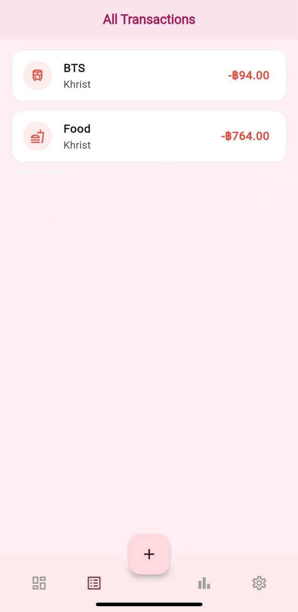
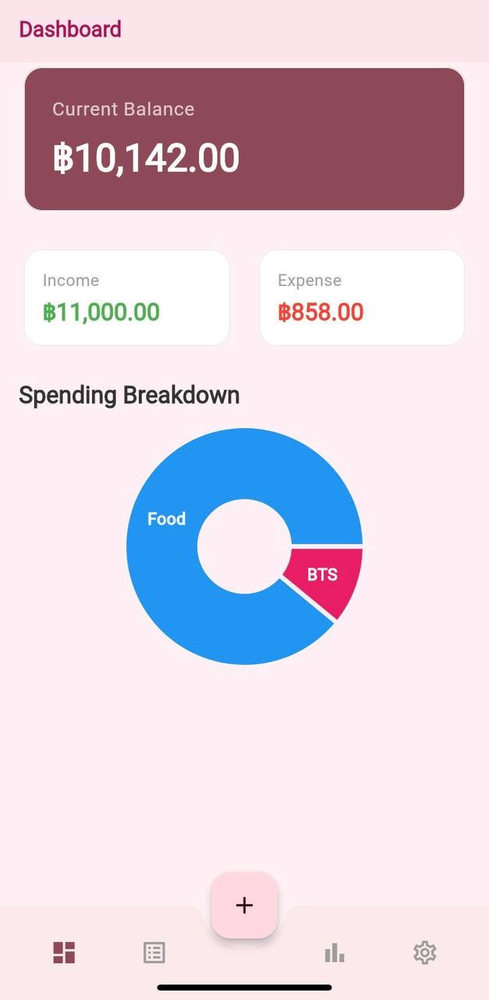
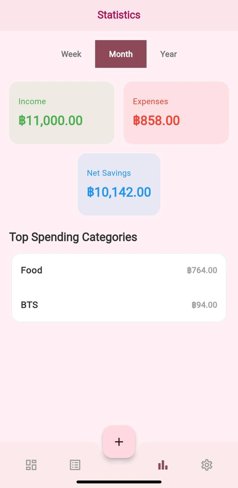
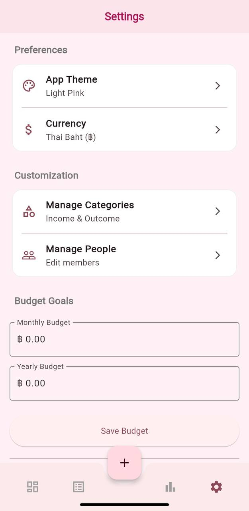

# 💰 Flutter Finance PWA: Personal IO Manager

A **Progressive Web App (PWA)** built with **Flutter** for modern, simple, and effective personal financial tracking. This application allows users to record daily income and outcome (expenses), manage budgets, and analyze their financial habits through a clean, user-friendly interface.

> _It's highly recommended to add a screenshot of your app here!_
> 
>  
 

---

## ✨ Features

- **📝 Daily Transaction Logging**  
  Quickly add any income or expense, no matter how small.

- **🔐 User Authentication**  
  Secure user accounts with email and password (powered by Firebase Authentication).

- **📁 Categorization**  
  Assign categories (e.g., *Food*, *Salary*, *Shopping*) and people (e.g., *Me*, *Partner*) to each transaction for detailed tracking.

- **📸 Receipt Uploads**  
  Attach a photo of your receipt to any transaction for better record-keeping (stored efficiently as Base64 in Firestore).

- **💸 Budget Management**  
  Set monthly and yearly budget goals and track your progress.

- **📊 Insightful Analytics**  
  A dedicated statistics page shows spending trends by week, month, or year, including top spending categories.

- **🧩 Data Visualization**  
  Interactive pie charts on the dashboard give you a quick overview of your spending habits by category and by person.

- **🎛️ Customization**
  - Create and manage your own custom income/outcome categories.
  - Add and manage people for shared account tracking.
  - Choose your preferred currency (e.g., THB, USD, EUR).
  - Personalize the app's look and feel with multiple themes (Light, Dark, Grey, Pink, Purple).

- **📱 Progressive Web App (PWA)**  
  Installable on any device (iOS, Android, Desktop) directly from the browser for a native-app-like experience.

- **🖥️ Responsive UI**  
  A clean, modern interface that works beautifully on both mobile and desktop screens.

---

## 🚀 Tech Stack

- **Frontend**: Flutter (Web)
- **Backend**: Firebase
  - Authentication
  - Firestore (NoSQL Database)
  - Firebase Hosting
- **State Management**: Provider
- **Charts**: `fl_chart`
- **Animations**: `flutter_staggered_animations`

---
